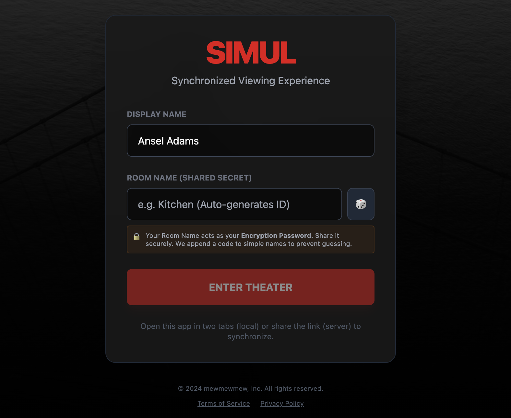
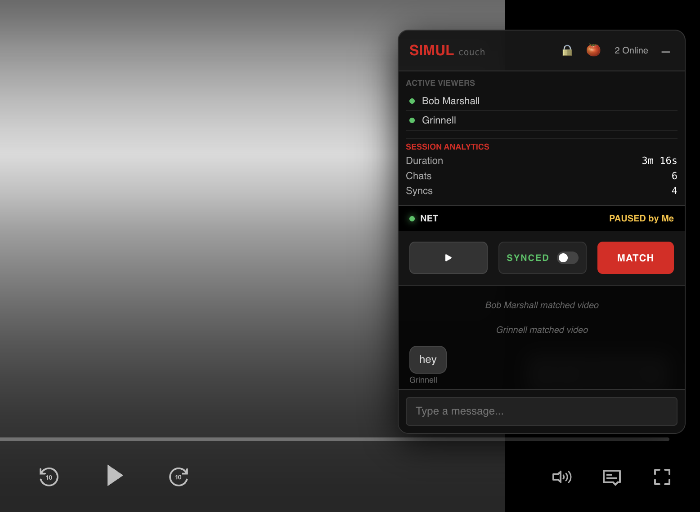
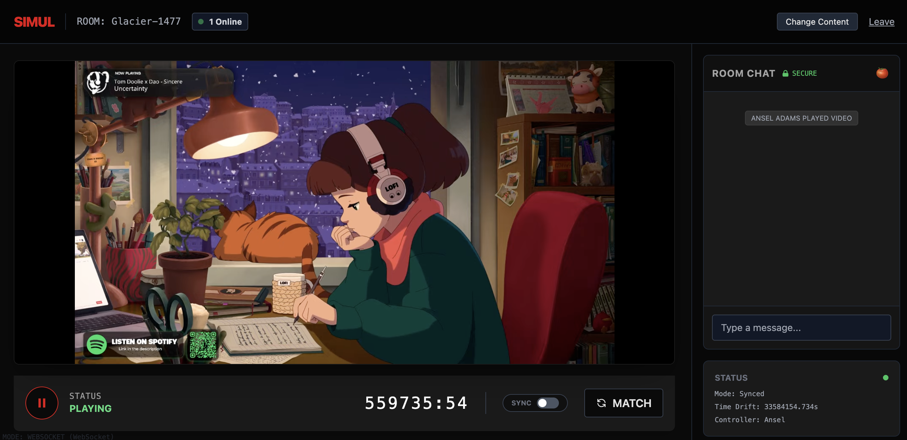
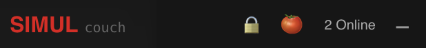

# SIMUL

<div align="center">
  
  
  <h2 style="margin-top: 20px;">The Privacy-First Synchronization Engine</h2>
  
  <p>
    <strong>SIMUL</strong> is a deterministic state synchronization engine that sits on top of streaming services (Netflix, HBO Max, Disney+, YouTube) to create a frame-perfect shared viewing experience.
  </p>

  <p>
    <a href="https://simul.watch"><strong>🌐 Website</strong></a> · 
    <a href="#-installation"><strong>⬇️ Install Extension</strong></a> · 
    <a href="#-security--privacy"><strong>🛡️ Security Audit</strong></a>
  </p>
  
  <p>
    
    
    
  </p>
</div>

---

## 📸 Experience Gallery

### 1. The Setup
Create a secure, ephemeral room in seconds. No accounts required.
<div align="center">
  <!-- SUGGESTION: Screenshot of the Landing Page / "Create Room" screen -->
  
</div>

### 2. The Overlay (Netflix/Max)
The extension injects a lightweight "Sidecar" overlay directly into the native player. It works *with* the streaming service, not against it.
<div align="center">
  <!-- SUGGESTION: Screenshot of HBO Max or Netflix with the SIMUL sidebar open showing chat -->
  
</div>

### 3. Synced Controls & Drift Correction
When you pause, everyone pauses. If your network lags, our drift correction engine automatically snaps you back to the group timeline.
<div align="center">
  <!-- SUGGESTION: Close up of the "Match" button and the Play/Pause state syncing -->
  
</div>

### 4. Privacy & Encryption Verification
We prove our security. The Green Lock icon confirms your chat is encrypted client-side.
<div align="center">
  <!-- SUGGESTION: Close up of the Green Lock icon and maybe an encrypted/decrypted message log -->
  
</div>

---

## 🎬 Supported Platforms

SIMUL acts as a "Universal Adapter" for the web's most popular video players.

| Platform | Support Level | Features |
| :--- | :--- | :--- |
| **YouTube** | Native | Full Sync, Chat, Seek |
| **Netflix** | Extension | Full Sync, Chat, Overlay |
| **HBO Max** | Extension | Full Sync, Chat, Overlay |
| **Disney+** | Extension | Full Sync, Chat, Overlay |
| **Amazon Prime** | Extension | Full Sync, Chat, Overlay |
| **Hulu** | Extension | Full Sync, Chat, Overlay |
| **Direct MP4** | Native | Sync, Chat |

---

## 🛡️ Security & Privacy

We believe "Trust" requires "Verification." That is why this client repository is open source.

### 🔒 End-to-End Encryption (E2EE)
*   **Architecture:** Zero-Knowledge.
*   **Protocol:** Chat messages are encrypted in your browser using **AES-GCM (256-bit)**.
*   **Keys:** Your encryption key is derived from your **Room ID** (PBKDF2). The server never sees the key, only the encrypted binary blobs.

### ♻️ Data Retention (The "5-Minute Rule")
*   **Volatile Memory:** Active rooms exist only in the server's RAM.
*   **Garbage Collection:** Once the last user leaves, the room and all its history are **permanently deleted** from memory within 5 minutes.
*   **No Database:** We do not maintain a database of user conversations or watch history.

[Read our full Security Policy](./SECURITY_AND_PRIVACY.md)

---

## ⚡ Installation

### 1. Chrome / Brave / Edge (Developer Mode)
*Currently in Review for Chrome Web Store. For now, install manually:*

1.  **Download** this repository (Code -> Download ZIP) and unzip it.
2.  Open your browser extensions page (`chrome://extensions`).
3.  Enable **Developer Mode** (Top right toggle).
4.  Drag and drop the `extension` folder onto the page.
5.  Pin the **Red "S"** icon to your toolbar.

### 2. Safari (macOS)
1.  Open Terminal in the project folder.
2.  Run `xcrun safari-web-extension-converter ./extension`.
3.  Build via Xcode and enable in Safari Settings.

---

## 💻 Development

This repository contains the client-side logic and extension adapter.

```bash
# Install dependencies
npm install

# Build the Web App
npm run build

# The extension code lives in /extension and requires no build step (Vanilla JS)
```

---

<div align="center">
  <sub>Built by mewmewmew, Inc.</sub>
</div>

